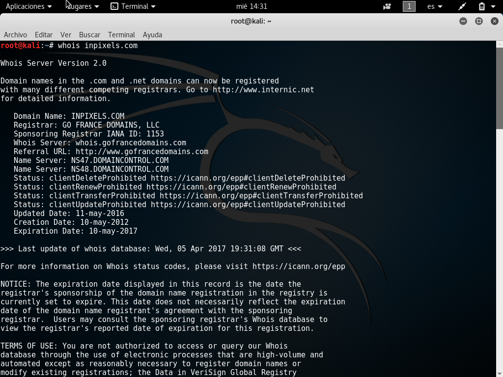

## WHOIS
Nos sirve para ver información del registrador de un dominio. En algunos casos puede contener información sensible como teléfonos, nombres de persona, correos, direcciones, etc.

```ssh
  whois inpixels.com
```


